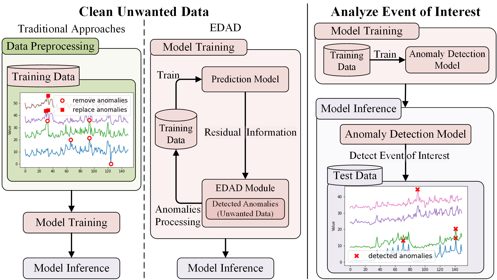
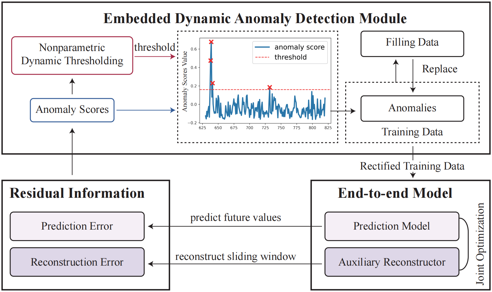

# EDAD

EDAD, an Embedded Dynamic Anomaly Detection Module, which seamlessly integrates anomaly detection within the time series forecasting training process to enhance model training.

This repository is a demo that uses Preformer as an example to adapt EDAD.

## Intro

Abnormal data in the training set can disrupt the learning process. Consequently, addressing anomalies in the training
data is crucial for improving the performance of time series
prediction models. 

Accurately identifying and appropriately handling anoma-
lies in training data is a challenging task. Anomaly detection
methods are split into two main categories based on their
purpose: ”cleaning unwanted data” and analyzing ”events of
interest”. 
"Analyze Event of Interest" focused on specific
events like fraud detection, has been widely studied, where
methods rely on modeling normal data to spot anomalies
during inference through residual information. However, data cleaning methods have limitations. Most still
rely on traditional distribution-based or numerical detection
method. We introduce an embedded dynamic anomaly
detection module, EDAD, which seamlessly incorporates
anomaly detection and processing as an integral plug-and-
play component for optimizing time series model training.

## EDAD
